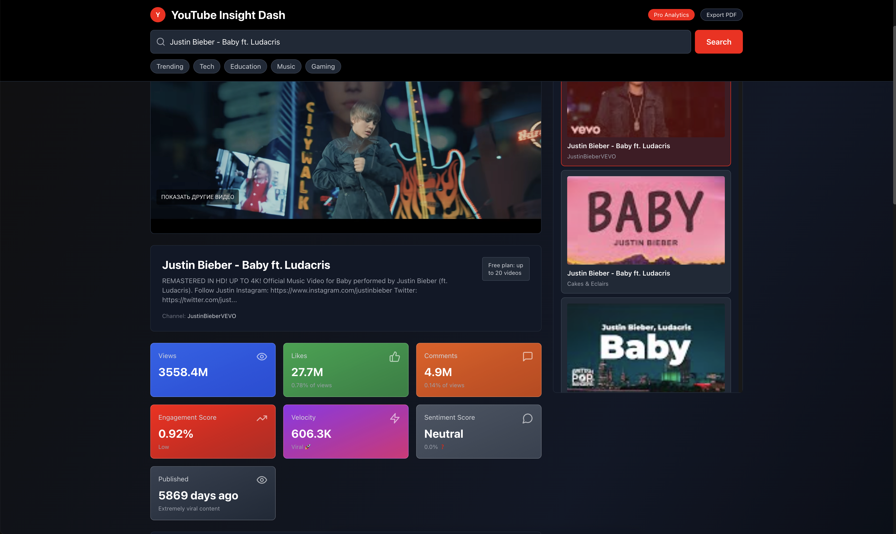

# 📊 YouTube Insight Dash - Professional Video Analytics Platform

A modern, elegant web application for deep YouTube video analysis with real-time engagement metrics, analytics, and SEO insights.

> **⚡ Quick setup?** See [QUICK_START.md](QUICK_START.md) (5 min)  
> **📖 Detailed guide?** See [SETUP.md](SETUP.md)

## 🎯 Overview

YouTube Insight Dash transforms YouTube data into actionable business intelligence. Perfect for content creators, marketers, and strategists who want to:

- 🔍 **Search & Discover** videos with intelligent filtering
- 📊 **Analyze Performance** with custom engagement metrics
- 🏷️ **Extract SEO Data** with one-click tag management
- 📈 **Compare Metrics** across similar content
- 📉 **Visualize Trends** with interactive charts

### 📸 Screenshot



## 🛠 Tech Stack

| Layer | Technology | Purpose |
|-------|-----------|--------|
| **Frontend** | React 18 | Component-based UI with Hooks |
| **Build Tool** | Vite | Lightning-fast dev & production builds |
| **Styling** | Tailwind CSS 3 | Modern responsive design |
| **Icons** | Lucide React | 312+ lightweight icons |
| **State** | TanStack Query | API caching & data synchronization |
| **HTTP** | Axios | Robust API client |
| **Charts** | Recharts | Interactive data visualization |

## 📦 Project Structure

```
src/
├── api/
│   └── youtubeApi.js              YouTube API v3 client
├── components/
│   ├── Search/SearchBar.jsx        Search + quick filters
│   ├── Video/
│   │   ├── VideoPlayer.jsx         Embedded player
│   │   └── VideoList.jsx           Results thumbnails
│   ├── Analytics/AnalyticsPanel.jsx KPI cards & stats
│   └── Charts/
│       ├── ComparisonChart.jsx     Bar chart
│       └── EngagementChart.jsx     Pie chart
├── hooks/useDebounce.js            Debounced input
├── utils/formatting.js             Utilities
└── App.jsx                         Main dashboard
```

## 🚀 Key Features

### 📍 Intelligent Search
- **Debounced input** — Triggers after 500ms (reduces API calls by 90%)
- **Quick filter buttons** — Trending, tech, educational, music, gaming
- **Real-time loading** — Visual feedback with loaders

### 📊 Deep Video Analytics

**Engagement Score (KPI):**
$$\text{Score} = \frac{\text{Likes} + \text{Comments}}{\text{Views}} \times 100$$

| Level | Range | Interpretation |
|-------|-------|----------------|
| Excellent | ≥10% | Highly engaged audience |
| Good | ≥5% | Strong performance |
| Average | ≥2% | Acceptable metrics |
| Low | <2% | Needs improvement |

**Analyzed Metrics:**
- View count (formatted: 1.2M, 45K)
- Like-to-view ratio
- Comment-to-view ratio  
- Velocity score (views/day)
- Visual progress breakdowns

### 🏷️ SEO Tools
- Extract all video tags
- Copy as comma-separated list
- Analyze tag patterns across channels

### 📊 Comparison Analytics
- Compare against top 5 channel videos
- Interactive bar chart (click to select)
- Engagement pie chart
- Side-by-side metrics

## � Getting Started

**⚡ Quick setup (5 min):**
```bash
cp .env.example .env.local
# Add your YouTube API key to .env.local
npm install && npm run dev
```

**For detailed instructions:** See [SETUP.md](SETUP.md)

**To understand configuration:** See [CONFIG_STRUCTURE.md](CONFIG_STRUCTURE.md)

## 🔑 Configuration

Required environment variable:
- `VITE_YOUTUBE_API_KEY` — YouTube Data API v3 key (from [Google Cloud Console](https://console.cloud.google.com/))

> ⚠️ Never commit `.env.local`. Always use `.env.example` as template.

## 📊 Metrics Reference

| Metric | Formula | Interpretation |
|--------|---------|-----------------|
| **Engagement Score** | (Likes + Comments) / Views × 100 | Higher is better; 5-10% is excellent |
| **Like Rate** | Likes / Views × 100 | How many viewers liked the video |
| **Comment Rate** | Comments / Views × 100 | How many viewers engaged in discussion |
| **Engagement Level** | Calculated score bracket | Quick reference for performance |
| **Velocity** | Views / Days published | Average views per day |
| **Sentiment** | Comment analysis | Audience mood indicator |

## 🎨 Design

YouTube-inspired dark theme:
- Dark backgrounds with red accents
- Responsive grid layout
- Accessible color contrasts

## ⚡ Performance

- **React Query caching** — 5-10 minute result cache
- **Debounced search** — 90% fewer API calls
- **Lazy components** — Code splitting
- **Optimized images** — Thumbnail caching
- **Minimal CSS** — Tailwind utility classes

## ⚠️ API Rate Limits

YouTube API Free Tier:
- **10,000 units/day** (≈100-200 videos/month)
- **100 units** per search
- **1 unit** per video detail

[Monitor quota →](https://console.cloud.google.com/apis/dashboard)

## 🔒 Security

✅ API key never in source code  
✅ `.env.local` protected by `.gitignore`  
✅ Environment variables for production  

See [CONFIG_STRUCTURE.md](CONFIG_STRUCTURE.md) for details.

## 📚 Available Commands

```bash
npm run dev      # Development server (http://localhost:8000)
npm run build    # Production build
npm run preview  # Preview production build
npm run lint     # Code linting
```

## 🔗 Resources

- [React](https://react.dev)
- [Youtube API](https://developers.google.com/youtube/v3)
- [TanStack Query](https://tanstack.com/query)
- [Tailwind CSS](https://tailwindcss.com)
- [Recharts](https://recharts.org)

## 📄 License

MIT License — Open source and free to use.

## 💡 Future Features

- [ ] Trend analysis over time (chart with historical data)
- [ ] Compare multiple videos side-by-side
- [ ] Export reports as PDF
- [ ] Dark/Light theme toggle
- [ ] Playlist analysis
- [ ] Channel analytics
- [ ] Mobile app with React Native

## 🤝 Contributing

Contributions welcome! Please:
1. Fork repository
2. Create feature branch (`git checkout -b feature/amazing`)
3. Commit changes (`git commit -m 'Add amazing feature'`)
4. Push to branch (`git push origin feature/amazing`)
5. Open Pull Request

## 📧 Support

Have questions? Issues? Suggestions?
- Create an [Issue](https://github.com/yourusername/youtube-insight-dash/issues)

---

**Built with ❤️ in 2024 | Professional Grade Analytics for YouTube** 
 
